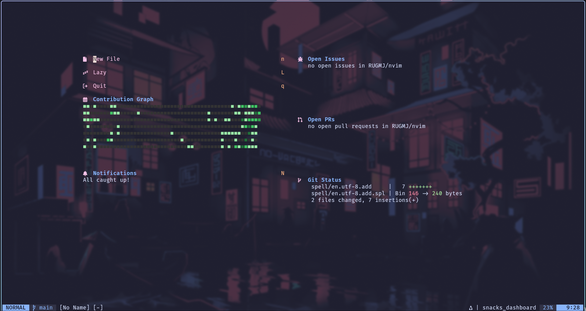
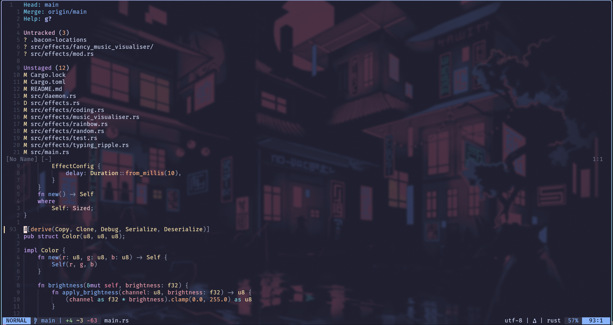
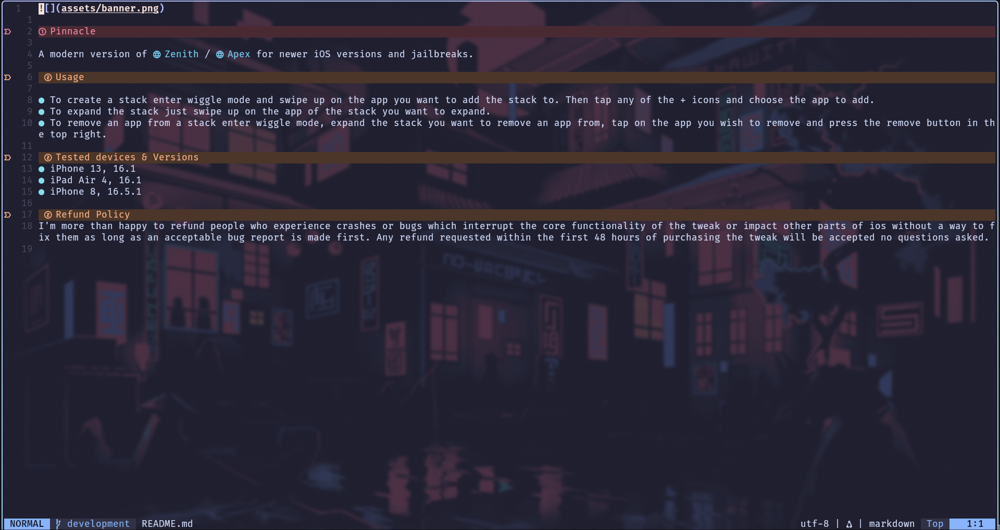

# My neovim config

## Screenshots

 
 
 
 
 

## Plugins

- (catppuccin)[https://github.com/catppuccin/nvim] - Colour Theme
- (cmp-nvim-lsp)[https://github.com/hrsh7th/cmp-nvim-lsp] - Autocomplete lsp entries
- (cmp_luasnip)[https://github.com/saadparwaiz1/cmp_luasnip] - Autocomplete snippets
- (dressing.nvim)[https://github.com/stevearc/dressing.nvim] - Beautiful ui
- (fidget.nvim)[https://github.com/j-hui/fidget.nvim] - LSP Messages
- (friendly-snippets)[https://github.com/rafamadriz/friendly-snippets] - Premade snippets
- (gitsigns.nvim)[https://github.com/lewis6991/gitsigns.nvim] - Git signs on the left
- (indent-blankline.nvim)[https://github.com/lukas-reineke/indent-blankline.nvim] - Shows indentation
- (lazy.nvim)[https://github.com/folke/lazy.nvim] - Plugin Manager
- (logos.vim)[https://github.com/Tyilo/logos.vim] - Syntax highlighting for logos
- (lualine.nvim)[https://github.com/nvim-lualine/lualine.nvim] - Nice status bar
- (LuaSnip)[https://github.com/L3MON4D3/LuaSnip] - Snippets engine
- (mason-lspconfig.nvim)[https://github.com/williamboman/mason-lspconfig.nvim] - Automatic integration with mason + lspconfig
- (mason-nvim-dap.nvim)[https://github.com/jay-babu/mason-nvim-dap.nvim] - Automatic integration with mason + dap
- (mason.nvim)[https://github.com/williamboman/mason.nvim] - Installs LSPs for you
- (mini.icons)[https://github.com/echasnovski/mini.icons] - Fancy icons
- (mini.pairs)[https://github.com/echasnovski/mini.pairs] - Automatically inserts the closing bracket / quote
- (mini.surround)[https://github.com/mini.surround] - Makes working with character pairs easy
- (neocord)[https://github.com/IogaMaster/neocord] - Discord presence
- (neodev.nvim)[https://github.com/folke/neodev.nvim] - Neovim-related autocomplete in lua files
- (nvim-cmp)[https://github.com/hrsh7th/nvim-cmp] - Autocompletion engine
- (nvim-dap)[https://github.com/mfussenegger/nvim-dap] - Debugger engine
- (nvim-dap-go)[https://github.com/leoluz/nvim-dap-go] - Go Debugger
- (nvim-dap-ui)[https://github.com/rcarriga/nvim-dap-ui] - Debugger ui
- (nvim-jdtls)[https://github.com/mfussenegger/nvim-jdtls] - Better java tooling
- (nvim-lspconfig)[https://github.com/neovim/nvim-lspconfig] - LSPs
- (nvim-nio)[https://github.com/nvim-neotest/nvim-nio] - Async io
- (nvim-treesitter)[https://github.com/nvim-treesitter/nvim-treesitter] - Syntax highlighting, automated indentation and other fun utils
- (nvim-treesitter-textobjects)[https://github.com/nvim-treesitter/nvim-treesitter-textobjects] - Allows working with 'textobjects'
- (oil.nvim)[https://github.com/stevearc/oil.nvim] - File browser / manager
- (plenary.nvim)[https://github.com/nvim-lua/plenary.nvim] - Random util functions
- (qmk.nvim)[https://github.com/codethread/qmk.nvim] - Automatically formats qmk keyboard layout
- (snacks.nvim)[https://github.com/folke/snacks.nvim] - Dashboard, (offers other things which i'm not using too)
- (telescope-fzf-native.nvim)[https://github.com/nvim-telescope/telescope-fzf-native.nvim] - Uses `fzf` for telescope
- (telescope-live-grep-args.nvim)[https://github.com/nvim-telescope/telescope-live-grep-args.nvim] - Allows more control over telescope grep
- (telescope.nvim)[https://github.com/nvim-telescope/telescope.nvim] - Search + Picker
- (tree-sitter-nu)[https://github.com/nushell/tree-sitter-nu] - Treesitter parser for nu
- (vim-be-good)[https://github.com/ThePrimeagen/vim-be-good] - Games to make you better at vim
- (vim-fanfingtastic)[https://github.com/dahu/vim-fanfingtastic] - Makes the default Ff and Tt motions better
- (vim-fugitive)[https://github.com/tpope/vim-fugitive] - Git integration
- (vim-repeat)[https://github.com/tpope/vim-repeat] - Adds dot repeat support to some plugins
- (vim-rhubarb)[https://github.com/tpope/vim-rhubarb] - Github commands
- (vim-sleuth)[https://github.com/tpope/vim-sleuth] - Guesses tab size from current file
- (vim-tabby)[https://github.com/TabbyML/vim-tabby] - AI (will replace with copilot once I get it)
- (vim-wakatime)[https://github.com/wakatime/vim-wakatime] - Wakatime integration
- (which-key.nvim)[https://github.com/folke/which-key.nvim] - Shows available keybinds, can be helpful for learning new binds
- (wildfire.nvim)[https://github.com/sustech-data/wildfire.nvim] - Better treesitter incremental selection
- (nvim-colorizer.lua)[https://github.com/norcalli/nvim-colorizer.lua] - Shows colours in css files
- (rust-tools.nvim)[https://github.com/simrat39/rust-tools.nvim] - Better rust tooling
